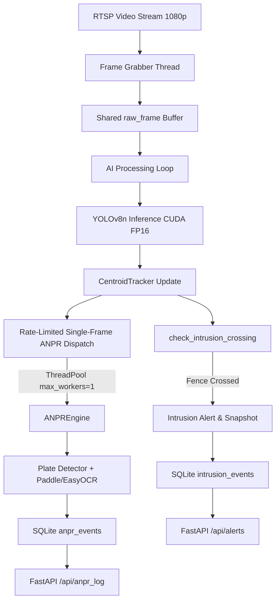

# PRAHARI-AI INTRUSION, SNAPSHOT & ANPR PIPELINE AUDIT

**Audit Date:** 2026-08-26  
**Audited Target:** `D:\PRAHARI-AI`  
**Video Reference:** `D:\PRAHARI-AI\demo_videos\border_demo.mp4` (1920x1080 @ 30 FPS)

---

## 1. Executive Summary

A comprehensive architectural and algorithmic audit of the PRAHARI-AI codebase was conducted to identify the root causes of:
1. Vehicles crossing the virtual fence without generating timely, useful intrusion snapshots.
2. Low ANPR detection rates and missed license plates for visible vehicles (cars, motorcycles, buses, trucks).
3. Short/partial OCR reads (e.g. `FX6786` instead of full Indian registration).
4. Lack of linkage between intrusion events and ANPR plate recognition.

---

## 2. Current Pipeline Flow & Responsible Components

### Exact Files & Functions Responsible:
- **Detection & Tracking Orchestration**: [rtsp_stream.py](file:///D:/PRAHARI-AI/rtsp_stream.py) (`_process_frame_ai`, `_ai_processing_loop`, `_frame_grabber_loop`)
- **Centroid & Fence Logic**: [centroid_tracker.py](file:///D:/PRAHARI-AI/centroid_tracker.py) (`CentroidTracker.update`, `CentroidTracker.check_intrusion_crossing`)
- **Plate Detection & OCR**: [anpr_engine.py](file:///D:/PRAHARI-AI/anpr_engine.py) (`ANPREngine.extract_plate_crop_from_vehicle`, `ANPREngine.read_plate`, `ANPREngine.validate_and_correct_plate`)
- **Persistence & Schema**: [database.py](file:///D:/PRAHARI-AI/database.py) (`DatabaseManager.log_intrusion_event`, `DatabaseManager.log_anpr_event`, `DatabaseManager.log_security_event`)
- **API Surface**: [main.py](file:///D:/PRAHARI-AI/main.py) (`/api/alerts`, `/api/anpr_log`, `/api/events/all`)
- **User Interface**: [templates/index.html](file:///D:/PRAHARI-AI/templates/index.html) (Live HUD, Intrusion Tab, ANPR Tab)

---

## 3. Root Cause Analysis of Current Problems

### Problem A: Over-Aggressive Proximity & Loop Suppression Blocking Genuine Intrusions
- **Location:** [rtsp_stream.py:576-589](file:///D:/PRAHARI-AI/rtsp_stream.py#L576-L589)
- **Root Cause:**
  1. `in_cooldown` was checking spatial proximity (`math.hypot(cx - ax, cy - ay) <= 80.0`) against ALL alerts in the last 4 seconds regardless of object ID. When two vehicles crossed near the same X coordinate, the second vehicle was dropped.
  2. `is_loop_duplicate` suppressed any object crossing within 220 pixels of any previous alert of the same broad vehicle class for 30 seconds. On a 13-second looping demo, this suppressed multiple legitimate crossings per cycle.

### Problem B: Intrusion Snapshots Lacked Annotated Context
- **Location:** [rtsp_stream.py:595](file:///D:/PRAHARI-AI/rtsp_stream.py#L595)
- **Root Cause:** Snapshots were saved from raw `clean_frame` without visual bounding boxes, track IDs, fence lines, direction indicators, or timestamps, making forensic review ambiguous.

### Problem C: Single-Worker Bottleneck and Global Lock in ANPR Dispatch
- **Location:** [rtsp_stream.py:765-767](file:///D:/PRAHARI-AI/rtsp_stream.py#L765-L767)
- **Root Cause:**
  1. `len(self.anpr_in_progress) == 0`: If vehicle A was running OCR in the background (taking 150–300ms), ANY other vehicle B, C, D crossing or visible during that period was completely ignored.
  2. `(now_ts - self._last_anpr_dispatch) >= 1.0`: Hardcoded 1.0s global throttle restricted ANPR to at most 1 vehicle per second across the whole camera.
  3. `crop_w >= 80 and crop_h >= 50`: Excluded smaller vehicle profiles and distant motorcycles.

### Problem D: Lack of Temporal Vehicle Ring Buffer & Multi-Frame Quality Selection
- **Location:** [rtsp_stream.py:772-785](file:///D:/PRAHARI-AI/rtsp_stream.py#L772-L785)
- **Root Cause:** Only a single arbitrary frame (at the instant `can_dispatch` evaluated true) was passed to ANPR. As vehicles approach and cross the fence, resolution and sharpness peak at specific angles. Without a rolling buffer of 5–15 frames per track, sub-optimal/blurry single frames resulted in missed plate detections.

### Problem E: Disconnection Between Intrusion Events and ANPR Results
- **Location:** [database.py](file:///D:/PRAHARI-AI/database.py), [rtsp_stream.py](file:///D:/PRAHARI-AI/rtsp_stream.py), [templates/index.html](file:///D:/PRAHARI-AI/templates/index.html)
- **Root Cause:**
  1. Intrusion events had no field or linkage for associated plate recognition (`plate_text`, `anpr_status`, `confidence`).
  2. If ANPR failed on a vehicle that crossed the fence, no plate status was recorded (`PLATE NOT READ`), leaving users unaware if ANPR was even attempted.

---

## 4. Targeted Action Plan & Implementation Blueprint

1. **Decouple Intrusion & ANPR**:
   - Intrusion fires immediately on centroid fence crossing with guaranteed annotated snapshot and SQLite record.
   - Enqueue vehicle track into a temporal buffer for asynchronous multi-frame ANPR enrichment.
2. **Implement Per-Track Ring Buffer (5–12 Frames)**:
   - For every tracked vehicle, maintain a bounded deque of recent frames with bounding boxes, quality metrics (Laplacian variance sharpness), and timestamps.
3. **Best Frame & Multi-Frame Consensus Selection**:
   - Filter candidate plate crops across the track's temporal buffer.
   - Select top quality crops, run OCR asynchronously, and aggregate character votes across observations.
4. **Enhanced Vehicle Coverage (Cars, Motorcycles, Buses, Trucks)**:
   - Dynamic crop padding (12% horizontal, 18% vertical) to capture motorcycle plates and high-mounted bus/truck plates.
5. **Intrusion-to-ANPR Linking in Database & Dashboard**:
   - Include `plate_text`, `plate_confidence`, and `anpr_status` (`VERIFIED`, `UNREADABLE`, `PENDING`) in intrusion data model.
6. **Fix Cooldown & Deduplication**:
   - Restrict alert suppression to strictly per-track ID state transitions (above -> below = IN, below -> above = OUT) with a 2.0s per-object cooldown rather than a broad spatial radius.
