# PRAHARI-AI — Multi-Camera Intelligent Surveillance & Security Analytics Platform

[](https://www.python.org/downloads/)
[](https://fastapi.tiangolo.com/)
[](https://react.dev/)
[](https://vitejs.dev/)
[](https://github.com/ultralytics/ultralytics)
[](https://pytorch.org/)
[](LICENSE)

> **Real-Time Multi-Camera Surveillance, Shared GPU Model Registry, Virtual Fence Perimeter Defense, Directional Breach Logic, Temporal Consensus ANPR, Privacy-Preserving Face Detection, Nocturnal Hysteresis, State-Machine Incident Management, Role-Based Access Control, and Resilient WebSocket Notifications.**

---

## Quick Navigation

| Section Group | Included Topics |
| :--- | :--- |
| **System Overview** | [1. Project Overview](#1-project-overview) • [2. Problem Statement](#2-problem-statement) • [3. Solution](#3-solution) • [4. Current Capabilities](#4-current-capabilities) • [5. Feature Matrix](#5-feature-matrix) |
| **Architecture & Pipeline** | [6. How PRAHARI-AI Works](#6-how-prahari-ai-works) • [7. High-Level Architecture](#7-high-level-architecture) • [8. End-to-End Data Flow](#8-end-to-end-data-flow) • [9. Video Ingestion](#9-video-ingestion) • [10. Multi-Camera Architecture](#10-multi-camera-architecture) |
| **Computer Vision Engines** | [11. Object Detection](#11-object-detection) • [12. Vehicle Classification](#12-vehicle-classification) • [13. Object Tracking](#13-object-tracking) • [14. Virtual Fence & Intrusion Detection](#14-virtual-fence--perimeter-intrusion-detection) • [15. IN / OUT Direction Logic](#15-in--out-direction-logic) |
| **Behavioral & Analytics** | [16. Night Surveillance](#16-night-surveillance) • [17. Night Movement Detection](#17-night-movement-detection) • [18. Loitering Detection](#18-loitering-detection) • [19. Suspicious Activity](#19-suspicious-activity) • [20. Face Detection & Privacy](#20-face-detection--privacy) |
| **ANPR & Vehicle Intelligence** | [21. ANPR Pipeline](#21-anpr-pipeline) • [22. ANPR Validation & Consensus](#22-anpr-validation--temporal-consensus) |
| **Operations & Security** | [23. Incident Management](#23-incident-management) • [24. Real-Time Notification System](#24-real-time-notification-system) • [25. Notification Recovery Architecture](#25-notification-recovery-architecture) • [26. RBAC & Security](#26-rbac--security) • [27. Admin Panel](#27-admin-panel) |
| **Operator Interface** | [28. Command Center Dashboard](#28-command-center-dashboard) • [29. Webcam Integration](#29-webcam-integration) • [30. Live Telemetry](#30-live-telemetry) |
| **Data & Technology** | [31. Database Architecture](#31-database-architecture) • [32. API Reference](#32-api-reference) • [33. Frontend Architecture](#33-frontend-architecture) • [34. Technology Stack](#34-technology-stack) • [35. Why Each Technology Is Used](#35-why-each-technology-is-used) • [36. Project Directory Structure](#36-project-directory-structure) |
| **Deployment & Verification** | [37. Installation](#37-installation) • [38. Configuration](#38-configuration) • [39. GPU / CUDA Setup](#39-gpu--cuda-setup) • [40. Running PRAHARI-AI](#40-running-prahari-ai) • [41. Webcam Setup](#41-webcam-setup) • [42. Automated Testing](#42-automated-testing) • [43. Current Validation Status](#43-current-validation-status) • [44. Performance](#44-performance) • [45. Troubleshooting](#45-troubleshooting) • [46. Repository Hygiene](#46-repository-hygiene) |
| **Team & Presentation** | [47. Team Quick Start](#47-team-quick-start) • [48. SIH Demo Flow](#48-sih-demo-flow) • [49. Known Limitations](#49-known-limitations) • [50. Future Roadmap](#50-future-roadmap) • [51. Privacy & Responsible AI](#51-privacy--responsible-ai) • [52. Contribution Workflow](#52-contribution-workflow) • [53. Credits](#53-credits) • [54. License](#54-license) |

---

## 1. Project Overview

**PRAHARI-AI** (*Pra-ha-ri* — Sanskrit for *Sentinel / Guardian*) is an edge-accelerated, multi-camera intelligent video surveillance and autonomous security analytics platform. It converts conventional CCTV installations into an active, automated perimeter monitoring and tactical incident command system.

Traditional physical security setups require human security personnel to continuously monitor multi-screen video walls. Studies show that after just 20 minutes of continuous observation, human operators miss up to 95% of subtle perimeter activity due to cognitive fatigue. PRAHARI-AI bridges this gap by continuously executing deep learning inference, multi-target tracking, geometric tripwire breach classification, optical character recognition on license plates, dwell-time loitering detection, and dual-threshold nocturnal classification directly at the edge.

The system is deployed locally with an air-gapped architecture, zero cloud dependency, asynchronous SQLite Write-Ahead Logging (WAL) persistence, and an interactive modern web dashboard serving live feeds, active telemetry, an Admin Management Suite, and low-latency WebSocket notifications.

### Low-Resource / SaaS Runtime Profiles

The default `lite` profile is intended for low-end CPU edge clients and SaaS trial deployments:

- 416px detector input and inference on every second frame
- Face detection and ANPR disabled unless explicitly enabled
- Lower JPEG quality to reduce CPU, bandwidth, and storage use
- Shared models remain one-per-process rather than one-per-camera

Set `PRAHARI_PROFILE=balanced` for face detection and ANPR, or `PRAHARI_PROFILE=high` for 640px full-rate detection. The launcher installs CUDA PyTorch only when `nvidia-smi` detects an NVIDIA GPU; CPU-only hosts use the base PyTorch packages.

---

## 2. Problem Statement

Perimeter surveillance at border checkpoints, industrial compounds, critical infrastructure facilities, and sensitive bases encounters systemic operational challenges:

1. **Operator Fatigue & Blind Spots**: Monitoring four or more high-resolution feeds concurrently causes severe attention degradation, resulting in missed security intrusions.
2. **Passive vs. Active Surveillance**: Standard CCTV setups act as forensic recording devices that are checked only *after* a perimeter breach has occurred, rather than intercepting security threats in real time.
3. **Hardware Exhaustion on Multi-Feed Ingestion**: Loading separate deep learning networks per camera feed rapidly exhausts GPU Video RAM (VRAM), preventing low-cost edge scaling.
4. **Manual Checkpoint Bottlenecks**: Logging vehicle registration numbers by hand at facility entry gates causes severe delays and transcription errors.
5. **Nocturnal Detection Failures**: Low ambient lighting masks unauthorized human and vehicle movement near physical fences.
6. **Alert Fatigue & Noise**: Systems that emit uncontrolled pop-up toasts for every moving object quickly overwhelm security teams, leading operators to ignore critical alerts.

---

## 3. Solution

PRAHARI-AI addresses these challenges through an integrated software architecture:

```
┌────────────────────────────────────────────────────────────────────────────────────────┐
│                                 THE PRAHARI-AI SOLUTION                                │
├──────────────────────────┬──────────────────────────┬──────────────────────────────────┤
│ Autonomous Edge AI       │ Shared GPU ModelRegistry │ Geometric Virtual Fence          │
│ Ingests 4 CCTV channels  │ Single GPU memory weight │ Exact centroid trajectories      │
│ + 1 dynamic webcam feed  │ allocation shared across │ classify directional breaches    │
│ with zero cloud latency. │ all camera worker threads│ ([IN] vs [OUT]) + snapshots.     │
├──────────────────────────┼──────────────────────────┼──────────────────────────────────┤
│ Temporal Consensus ANPR  │ Anti-Flicker Night Mode  │ Multi-Role Command & Admin       │
│ Multi-box OCR assembly + │ Dual-threshold (85/98)   │ Granular RBAC, incident state    │
│ Indian registration regex│ hysteresis prevents      │ machine, SQLite WAL persistence, │
│ + multi-frame voting.    │ day/night oscillation.   │ and live WebSocket notifications.│
└──────────────────────────┴──────────────────────────┴──────────────────────────────────┘
```

---

## 4. Current Capabilities

The current repository represents the fully operational PRAHARI-AI system:

- **Multi-Camera Stream Ingestion**: Simultaneously captures and processes 4 core video channels plus 1 dynamic USB/integrated hardware webcam.
- **Shared GPU Inference**: Singleton `ModelRegistry` hosts YOLOv8n, fine-tuned license plate YOLOv11n, and YuNet ONNX on CUDA with mutex locks.
- **Object Detection & Subtyping**: Detects Persons and classifies Vehicles into Car, Motorcycle, Bus, and Truck subtypes.
- **Centroid & IoU Tracking**: Maintains persistent target track IDs across frames with IoU overlap and Euclidean distance matching.
- **Virtual Fence Intrusion**: Evaluates crossing trajectories against per-camera horizontal tripwires, logging direction (`IN` vs `OUT`).
- **Evidence Snapshots**: Automatically writes full-resolution annotated JPEG snapshots to disk with bounding boxes, fence lines, and telemetry banners.
- **Temporal Consensus ANPR**: Localizes license plates, executes contrast-enhanced EasyOCR, validates Indian state syntax, and computes multi-frame temporal consensus.
- **Detection-Only Facial Analytics**: Computes visible face bounding boxes and live counts via YuNet without identity recognition or biometric storage.
- **Behavioral Loitering**: Detects stationary targets remaining within a 100-pixel radius for $\ge 20$ seconds using Exponential Moving Average (EMA) smoothing.
- **Dual-Threshold Night Vision**: Transitions between Day and Night modes using 85.0/98.0 grayscale luminance hysteresis.
- **Incident Lifecycle Management**: Promotes raw security events into trackable security incidents governed by an explicit 5-state machine.
- **Role-Based Access Control (RBAC)**: Enforces authorization across four distinct operational roles (`SUPER_ADMIN`, `ADMIN`, `SUPERVISOR`, `OFFICER`).
- **Admin Management Suite**: Full administrative web UI for managing system users, camera configs, virtual fence zones, alert rules, and audit trails.
- **Real-Time Notifications**: Dedicated WebSocket alert stream with missed-event recovery via `since_id` cursors and REST fallback.
- **Tactical Command Center**: Responsive React + Vite dashboard with a simplified SIH-inspired civic visual system, clear action hierarchy, compact KPI status board, responsive camera wall, live incident rail, Focus View modals, and SQL analytics.
- **Evidence Integrity Ledger**: Local append-only SHA-256 hash chain anchors intrusion events, ANPR events, security events, incidents, incident updates, and administrative audit actions without storing raw surveillance data on-chain.
- **Integrity Verification APIs**: Authorized administrators can inspect ledger health, recompute the complete chain, and list hash metadata through `/api/admin/blockchain/*`.

---

## 5. Feature Matrix

The following source-of-truth matrix details where each major capability is implemented, persisted, and tested:

| Feature | Backend Implementation | AI / Vision Engine | Database Table | API Route | Frontend Component | Test Coverage |
| :--- | :--- | :--- | :--- | :--- | :--- | :--- |
| **Multi-Camera Ingestion** | `camera_manager.py` | OpenCV `VideoCapture` | `camera_configs` | `GET /api/cameras` | `CameraGrid.jsx` | `test_full_suite.py` |
| **Dynamic Webcam** | `camera_manager.py` | Hardware V4L2/DShow | `camera_configs` | `POST /api/webcam/start` | `Header.jsx`, `CameraCard.jsx` | `test_final_acceptance_suite.py` |
| **Object Detection** | `rtsp_stream.py` | YOLOv8n (CUDA FP16) | N/A (Frame Telemetry) | `GET /api/status/{cam_id}` | `CameraCard.jsx` | `test_final_acceptance_suite.py` |
| **Vehicle Subtyping** | `rtsp_stream.py` | YOLO COCO classes | `intrusion_events` | `GET /api/alerts` | `ActivityFeed.jsx` | `test_final_acceptance_suite.py` |
| **Multi-Object Tracking** | `centroid_tracker.py` | Centroid + IoU Matching | N/A (Active Memory) | `GET /api/status/{cam_id}` | `CameraStream.jsx` | `test_final_acceptance_suite.py` |
| **Virtual Fence Intrusion** | `rtsp_stream.py` | Trajectory vs Y-Ratio | `intrusion_events` | `GET /api/alerts` | `ActivityFeed.jsx`, `Lightbox.jsx` | `test_p0_regressions.py` |
| **Direction Logic** | `rtsp_stream.py` | Centroid Y History | `intrusion_events` | `GET /api/alerts` | `ActivityFeed.jsx` | `test_p0_regressions.py` |
| **Evidence Snapshots** | `rtsp_stream.py` | OpenCV Image Encoding | `intrusion_events` | `GET /static/alerts/...` | `Lightbox.jsx` | `test_final_acceptance_suite.py` |
| **ANPR Localization** | `anpr_engine.py` | YOLOv11n Plate Detector | `anpr_events` | `GET /api/anpr_log` | `ActivityFeed.jsx` | `test_anpr_accuracy_fix.py` |
| **ANPR OCR & Consensus** | `anpr_engine.py`, `anpr_consensus.py` | EasyOCR + Temporal Voting | `anpr_events` | `GET /api/anpr_log` | `ActivityFeed.jsx` | `test_anpr_accuracy_fix.py` |
| **Night Surveillance** | `rtsp_stream.py` | Grayscale Hysteresis | `security_events` | `GET /api/night_status` | `CameraCard.jsx` | `test_final_acceptance_suite.py` |
| **Loitering Detection** | `rtsp_stream.py` | Spatial Anchor + EMA | `security_events` | `GET /api/security_events` | `ActivityFeed.jsx` | `test_final_acceptance_suite.py` |
| **Face Detection (Privacy)** | `rtsp_stream.py` | YuNet ONNX (No Recognition) | N/A (Frame Telemetry) | `GET /api/face_stats` | `Header.jsx`, `CameraCard.jsx` | `test_final_acceptance_suite.py` |
| **Incident Lifecycle** | `database.py` | State Machine Logic | `incidents` | `GET /admin/api/incidents` | `AdminIncidents.jsx`, `LiveIncidents.jsx` | `test_admin_hardening.py` |
| **Notification Engine** | `notifications/` | Real-time WS & REST | `notifications`, `user_notifications` | `GET /api/notifications` | `NotificationBell.jsx`, `NotificationDrawer.jsx` | `test_notification_forensic_suite.py` |
| **Admin & RBAC** | `admin/admin_routes.py`, `admin/auth.py` | Bcrypt + PyJWT Bearer | `admin_users`, `audit_logs` | `/admin/api/*` | `AdminLayout.jsx`, `AdminUsers.jsx` | `test_admin_auth.py`, `test_admin_rbac.py` |
| **Evidence Integrity Ledger** | `blockchain_ledger.py`, `database.py` | SHA-256 Hash Chain | `integrity_blocks` | `/api/admin/blockchain/*` | Admin APIs | Temporary database smoke validation |
| **Database Persistence** | `database.py` | SQLite WAL Engine | 15 Relational Tables | `/api/*` | React UI Clients | `test_full_suite.py` |

---

## 6. How PRAHARI-AI Works

Every frame ingested by PRAHARI-AI flows through an end-to-end analytical pipeline:

```
[ Video Stream (RTSP / File / Webcam) ]
                  │
                  ▼
[ Capture Thread (RTSPStreamReader) ] ──► (Drops stale frames; buffers latest)
                  │
                  ▼
[ Grayscale Thumbnail & Scene Check ] ──► (Computes luminance; checks video loop reset)
                  │
                  ▼
[ Shared YOLOv8n Object Detector ] ──► (Locates Persons & Vehicles on CUDA)
                  │
                  ▼
[ Centroid & IoU Tracker ] ──► (Associates detections; updates trajectory buffers)
                  │
         ┌────────┴────────────────────────┬──────────────────────┐
         ▼                                 ▼                      ▼
[ Virtual Fence Check ]          [ Loitering Evaluator ]   [ Amortized YuNet Faces ]
(IN / OUT breach detected)       (Anchor radius dwell >20s) (Every 8th frame: count faces)
         │                                 │                      │
         ▼                                 ▼                      ▼
[ High-Res Snapshot Saved ]      [ Security Event Logged ] [ Frame Telemetry Updated ]
(static/alerts/intrusion_*.jpg)  (prahari_events.db)       (Live Faces KPI counter)
         │                                 │
         └────────────────┬────────────────┘
                          ▼
             [ Incident Promotion Policy ]
             (Evaluates severity & cooldown)
                          │
                          ▼
             [ Notification Dispatcher ]
             (Maps recipients by RBAC role)
                          │
         ┌────────────────┴────────────────┐
         ▼                                 ▼
[ SQLite DB Persistence ]      [ WebSocket Live Dispatch ]
(user_notifications table)     (Real-time JSON frame to browser)
         │                                 │
         ▼
[ Hash-Linked Integrity Ledger ]
(SHA-256 hashes for events, evidence, incidents, and audit actions)
         │
         └────────────────┬────────────────┘
                          ▼
           [ Command Center Dashboard ]
           (Reconciles unread badge & drawer)
```

---

## 7. High-Level Architecture

The following Mermaid diagram depicts the complete runtime architecture:

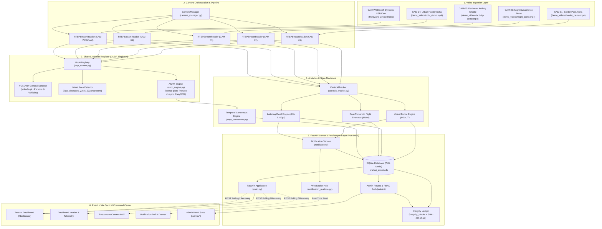

---

## 8. End-to-End Data Flow

The following sequence details how a physical security breach moves from raw pixels to an investigated incident:

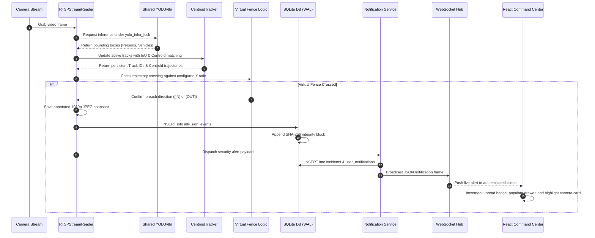

---

## 9. Video Ingestion

Video ingestion in PRAHARI-AI is decoupled from inference using dedicated background reader threads (`RTSPStreamReader` in `rtsp_stream.py`):

- **Stale Frame Dropping**: The ingestion loop reads frames into a single-frame buffer (`latest_frame`). If the AI pipeline takes 15 ms, subsequent frames overwrite the buffer so inference always operates on the most current frame.
- **Loop Discontinuity Guard**: When processing video file loops, natural loop seams can cause sudden spatial jumps. A low-resolution thumbnail comparison ($64 \times 36$ pixels) calculates frame differences. If difference $> 50.0$, active tracking states reset cleanly.
- **Automatic Reconnection**: If an RTSP stream or webcam drops frames, the reader enters an exponential backoff retry loop, logging disconnect events into `system_events`.

---

## 10. Multi-Camera Architecture

The platform provides out-of-the-box support for 4 core surveillance streams and 1 dynamic hardware webcam:

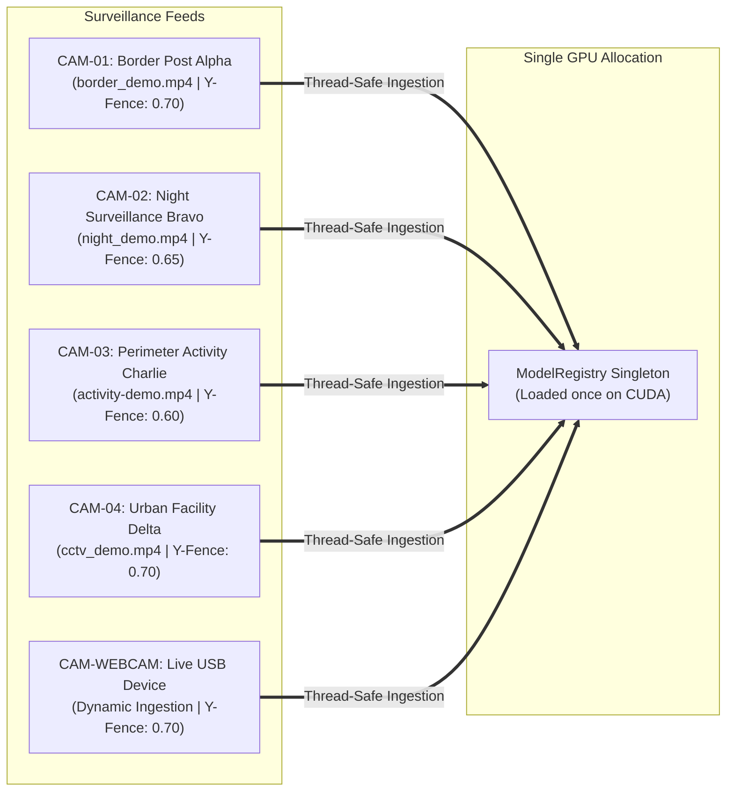

| Camera ID | Designation | Ingestion Source | Configured Tripwire ($Y$-Ratio) | Primary Focus |
| :--- | :--- | :--- | :---: | :--- |
| **CAM-01** | Border Post Alpha | `demo_videos/border_demo.mp4` | `0.70` (70% Height) | Perimeter breaches & ANPR vehicle logging |
| **CAM-02** | Night Surveillance Bravo | `demo_videos/night_demo.mp4` | `0.65` (65% Height) | Nocturnal monitoring & low-light movement |
| **CAM-03** | Perimeter Activity Charlie | `demo_videos/activity-demo.mp4` | `0.60` (60% Height) | Dwell-time loitering & pedestrian monitoring |
| **CAM-04** | Urban Facility Delta | `demo_videos/cctv_demo.mp4` | `0.70` (70% Height) | High-density pedestrian & vehicle tracking |
| **CAM-WEBCAM** | Live Operational Webcam | USB / Integrated Device (`/dev/video*`) | `0.70` (70% Height) | Live operational command & field demonstration |

---

## 11. Object Detection

Object detection is powered by Ultralytics **YOLOv8n** (`weights/yolov8n.pt`, SHA256: `F59B3D833E2FF32E194B5BB8E08D211DC7C5BDF144B90D2C8412C47CCFC83B36`).

- **Target Classes**: Predictions are filtered to security-relevant COCO classes:
  - Class `0`: **Person**
  - Class `1`: **Bicycle**
  - Class `2`: **Car**
  - Class `3`: **Motorcycle**
  - Class `5`: **Bus**
  - Class `7`: **Truck**
- **Confidence Threshold**: Standard detection confidence is set to `CONFIDENCE_THRESHOLD = 0.40`.
- **FP16 Inference**: Models are executed with half-precision floating-point (`FP16`) under CUDA to maximize frame throughput and minimize VRAM consumption.

---

## 12. Vehicle Classification

When a vehicle bounding box is localized, PRAHARI-AI classifies it into detailed subtypes:

- **Classification Logic**: If class ID $\in \{2, 3, 5, 7\}$ and detection confidence $\ge 0.40$, the vehicle is tagged with its specific subtype (`Car`, `Motorcycle`, `Bus`, `Truck`).
- **Fallback Category**: Low-confidence or ambiguous detections are logged under the generic label `Vehicle`.
- **Processed-Frame Telemetry**: The current-frame detection count is displayed on camera cards as:
  ```text
  Objects: TOTAL (XP, YV)
  ```
  *(e.g., `Objects: 12 (8P, 4V)` indicates 8 Persons and 4 Vehicles detected in the active frame).*

---

## 13. Object Tracking

Target tracking across consecutive video frames is performed by `CentroidTracker` in `centroid_tracker.py`:

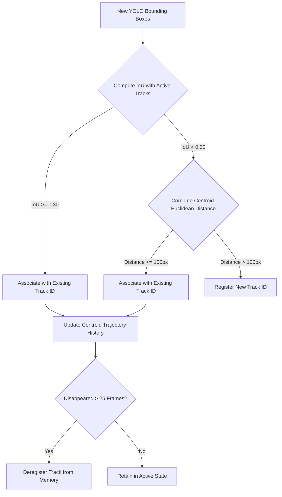

1. **IoU Association**: Detections are first matched against active tracks using an Intersection-over-Union threshold of `0.30`.
2. **Euclidean Fallback**: Remaining unmatched detections fall back to pairwise Euclidean centroid distance matching (maximum radius `100` pixels).
3. **Trajectory History**: Retains a rolling window of recent centroid coordinates (`trajectory_history` deque, maxlen `30`) to establish motion direction vectors.
4. **Deregistration Threshold**: Tracks that disappear for more than `max_disappeared = 25` frames are removed from memory to prevent memory leaks.

---

## 14. Virtual Fence & Perimeter Intrusion Detection

Virtual perimeter tripwires operate as horizontal geometric boundaries across the normalized camera plane:

- **Configurable Fence Line**: Defined as a normalized vertical ratio ($Y / H$), where $0.0$ is the top and $1.0$ is the bottom of the frame.
- **Crossing Determination**: Centroid trajectories ($Y_{prev}, Y_{curr}$) are compared against the fence coordinate ($Y_{fence} = \text{ratio} \times H$):
  - Downward crossing ($Y_{prev} < Y_{fence} \le Y_{curr}$) $\rightarrow$ `IN`
  - Upward crossing ($Y_{prev} > Y_{fence} \ge Y_{curr}$) $\rightarrow$ `OUT`
- **Jitter Protection**: Centroid motion must exceed a minimum displacement deadband ($> 8$ pixels) across the fence line to avoid false triggers from bounding box vibration.
- **Per-Track Cooldown**: Enforces a 10-second alert cooldown per Track ID to suppress duplicate alerts while an object remains near the boundary.

---

## 15. IN / OUT Direction Logic

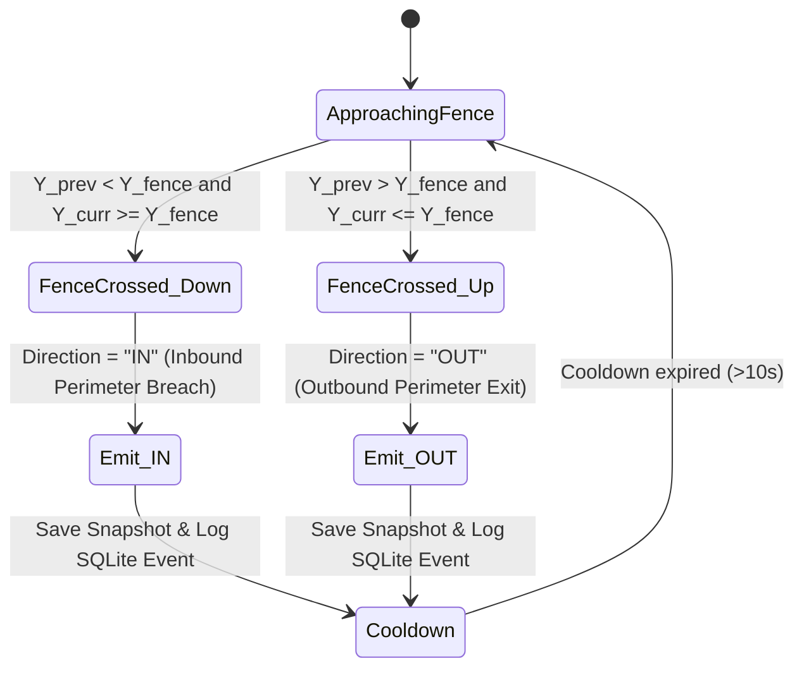

- **Operational Meaning**:
  - `IN`: Moving from the upper region of the camera view across the line into the protected compound (Inbound Intrusion).
  - `OUT`: Moving from inside the compound across the line toward the exterior perimeter (Outbound Movement).

---

## 16. Night Surveillance

Low-light surveillance relies on dual-threshold ambient luminance hysteresis calculated across a 15-frame rolling buffer:

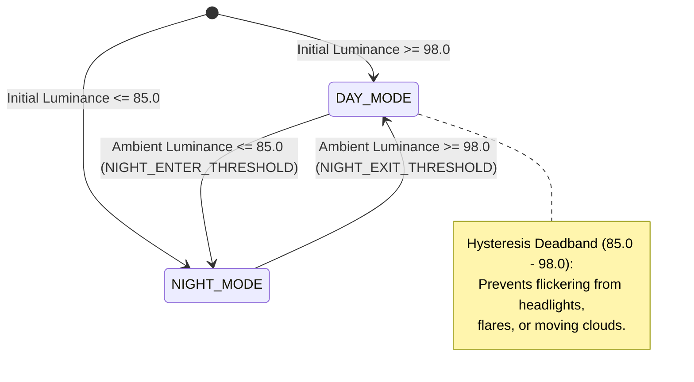

- **Luminance Calculation**: Combined mean and median pixel intensity of a downscaled grayscale frame thumbnail ($0.0–255.0$).
- **Anti-Flicker Deadband**: The 13-point deadband ($85.0$ to $98.0$) prevents rapid Day/Night state toggling when vehicle headlights or temporary spotlights illuminate the scene.

---

## 17. Night Movement Detection

When a camera is confirmed in `NIGHT` mode, the system activates nocturnal behavioral heuristics:

- **Centroid Displacement Metric**: Evaluates Euclidean displacement of active tracks over a 5-frame window.
- **Threshold**: Sustained displacement exceeding $15.0$ pixels during active night mode triggers a `night_movement` security alert.
- **Persistence**: Logged to `security_events` with `event_type = 'night_movement'` and flagged with `HIGH` priority on the Command Center activity feed.

---

## 18. Loitering Detection

The loitering engine detects unauthorized stationary dwell within perimeter zones:

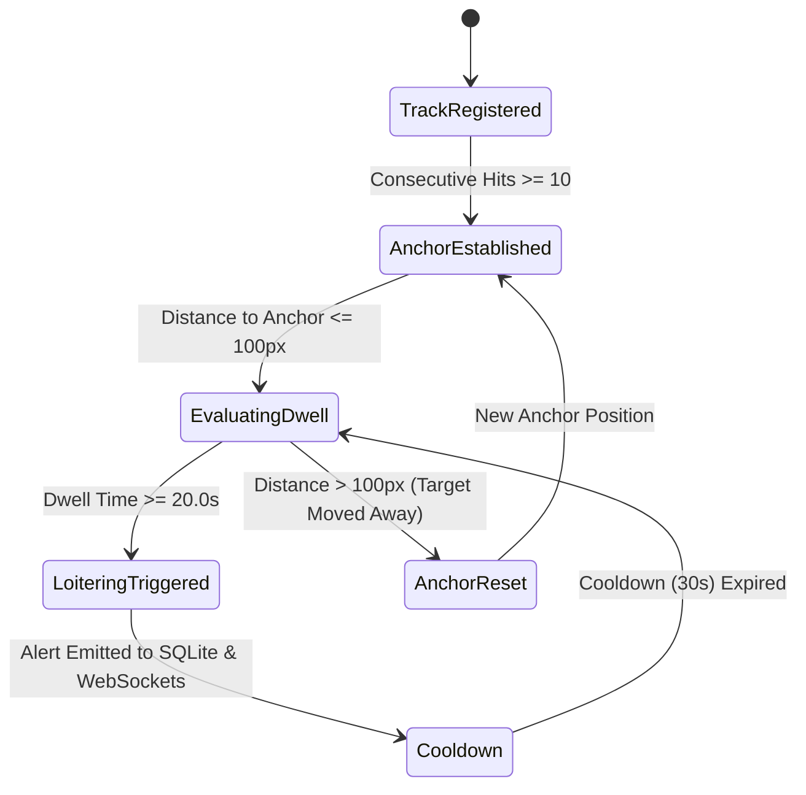

- **Spatial Anchor**: Established once a person track is confirmed with $\ge 10$ consecutive detection hits.
- **Dwell Timer**: Evaluates whether the smoothed centroid remains within `LOITERING_RADIUS_PIXELS = 100` for `LOITERING_TIME_SECONDS = 20.0`.
- **Smoothing Filter**: Applies Exponential Moving Average (EMA) smoothing ($0.95 \times \text{anchor} + 0.05 \times \text{current}$) to prevent false resets from minor body sway.

---

## 19. Suspicious Activity

PRAHARI-AI aggregates behavioral heuristics under suspicious activity classification:

- **Stationary Lingering Near Boundaries**: Persons remaining stationary within 15% distance of the virtual tripwire are flagged with elevated severity.
- **Unusual Vehicle Stops**: Vehicles stopping abruptly inside non-parking perimeter corridors.
- **Cooldown & Deduplication**: Each suspicious event is deduplicated by Track ID with a 30-second cooldown period.

---

## 20. Face Detection & Privacy

Facial analytics are powered by **YuNet ONNX** (`weights/face_detection_yunet_2023mar.onnx`):

- **Inference Pipeline**: Executed via OpenCV DNN (`cv2.FaceDetectorYN`) on head/upper-body crops of detected persons.
- **Amortized Frequency**: Evaluated once every 8th frame (`FACE_DETECTION_INTERVAL = 8`), yielding sub-2 ms amortized latency per feed.
- **Privacy & Responsible AI Guarantee**:
  - Face detection is **strictly detection-only** (identifying bounding boxes and face counts).
  - The system performs **no facial recognition** and **no identity matching**.
  - **No biometric database** or facial embeddings are created, extracted, indexed, or stored.
  - Camera cards display anonymized live counts (`Faces: N`) for crowd-density estimation only.

---

## 21. ANPR Pipeline

PRAHARI-AI employs a dedicated two-stage Automatic Number Plate Recognition pipeline:

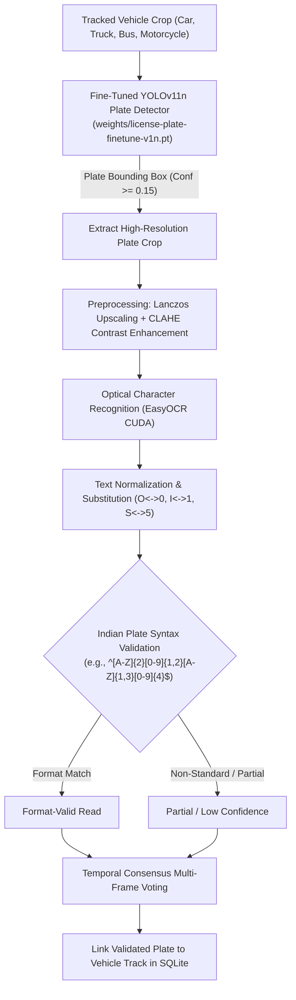

1. **Plate Localization**: Uses a specialized 1-class fine-tuned model (`license-plate-finetune-v1n.pt`, 5.46 MB) trained to localize plates under severe angles and distances.
2. **Contrast Preprocessing**: Plate crops undergo Lanczos upscaling, grayscale conversion, and Contrast Limited Adaptive Histogram Equalization (CLAHE).
3. **Character Extraction**: EasyOCR extracts alphanumeric candidate fragments with character bounding boxes.
4. **Syntactic Validation**: Checks candidate text against official Indian registration syntax schemas.

---

## 22. ANPR Validation & Temporal Consensus

> [!IMPORTANT]
> **Authoritative Vehicle Verification Clarification**:  
> PRAHARI-AI distinguishes between a **validated ANPR read** (syntactically valid plate matching format rules and temporal consensus) and **authoritative vehicle ownership verification**. PRAHARI-AI does **not** perform legal or ownership verification without an external connection to an authoritative government vehicle database (such as VAHAN).

### ANPR Validation Tiers

| Tier Name | Technical Meaning | Criteria |
| :--- | :--- | :--- |
| **`VALIDATED_READ`** | Recognized string matches standard Indian registration syntax with high confidence. | Regex match + OCR confidence $\ge 0.45$ + Valid state code. |
| **`DETECTED`** | Plate detected and characters extracted; minor formatting deviation. | Non-standard length or moderate OCR confidence ($0.25–0.44$). |
| **`LOW_CONFIDENCE`** | Text extracted, but quality fell below operational threshold. | OCR confidence $< 0.25$ or incomplete character count. |
| **`NOT_READ`** | Plate unreadable due to severe blur, occlusion, or extreme angle. | No characters localized. Reported honestly without hallucination. |

### Multi-Frame Temporal Consensus

To eliminate single-frame OCR misreads (e.g., confusing `M` with `H` or `0` with `O`), `anpr_consensus.py` accumulates up to 10 sequential plate observations per vehicle track:

- Observations are aligned character-by-character across time.
- Character-wise majority voting resolves flickering OCR noise.
- Outlier frames with low confidence are discarded, yielding a stable, consensus-valid plate reading.

---

## 23. Incident Management

Raw security events are promoted to trackable security incidents governed by an explicit 5-state lifecycle:

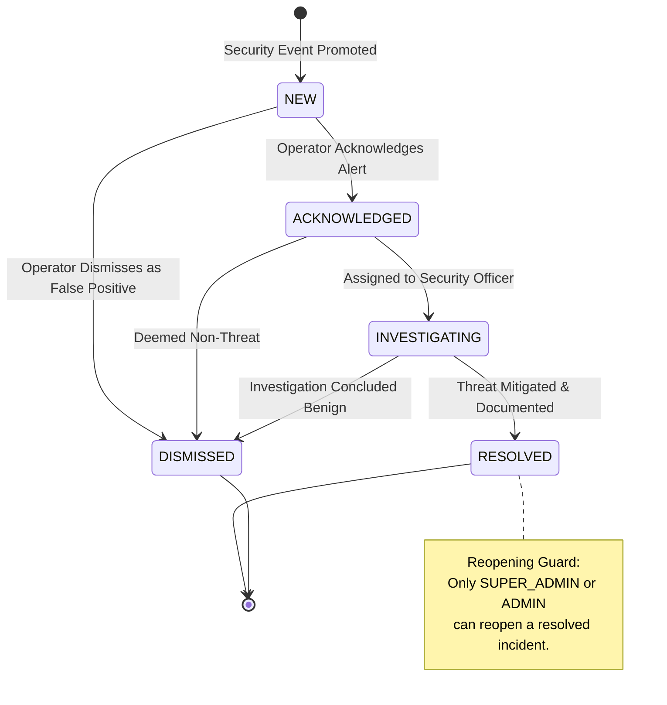

- **Severity Levels**: `LOW`, `MEDIUM`, `HIGH`, `CRITICAL`.
- **Deduplication Cooldown**: Identical security events on the same camera channel within 30 seconds are merged into the existing incident rather than spawning redundant tickets.
- **Audit Logging**: Every state transition, operator comment, and status change is recorded in `audit_logs` with timestamps and user IDs.

---

## 24. Real-Time Notification System

PRAHARI-AI enforces a robust, multi-tier notification architecture:

```
DATABASE = SOURCE OF TRUTH
REST = HISTORY & RECOVERY
WEBSOCKET = REAL-TIME DELIVERY
FRONTEND STATE = RECONCILED VIEW
BROWSER / SOUND = OPTIONAL CHANNELS
```

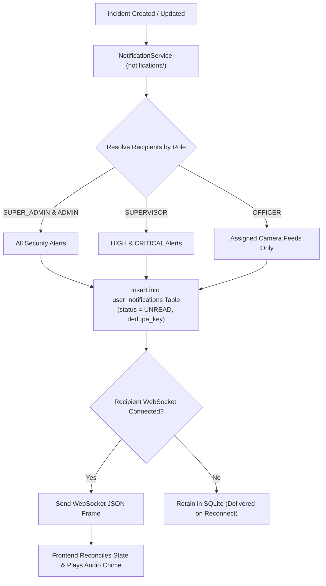

- **Deduplication Key**: Deterministic key formatting (`INC_{incident_id}_{type}_{severity}`) prevents duplicate notification inserts.
- **Alert Spam Prevention**: Intrusive full-screen toasts were intentionally replaced with a sleek notification bell badge, slide-out notification drawer, and optional audio chime.

---

## 25. Notification Recovery Architecture

When an operator's browser experiences network drops or computer sleep, the system recovers missed alerts seamlessly:

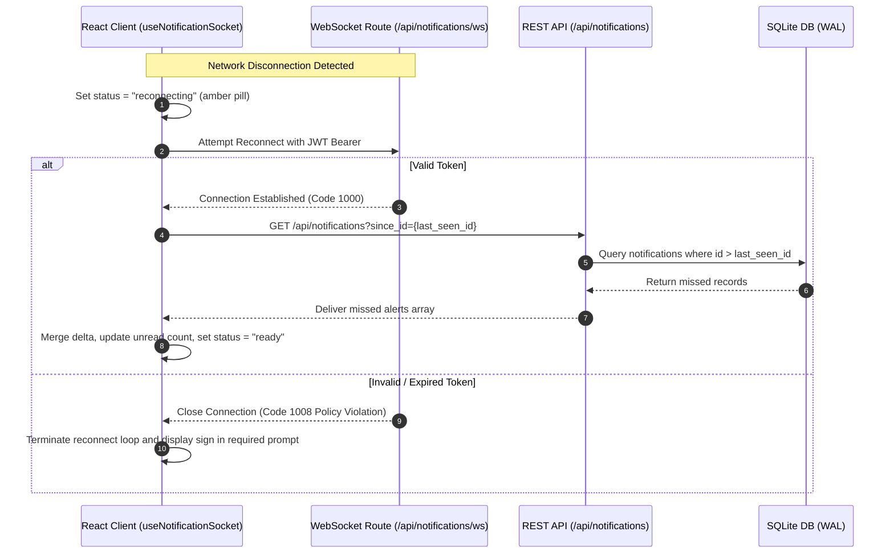

- **Delta Cursor (`since_id`)**: On reconnect, the client requests only records newer than its highest received ID, preventing redundant data transfers.
- **Strict Code 1008 Rejection**: Unauthenticated socket handshakes are immediately rejected with close code `1008`, preventing infinite reconnect storms.

---

## 26. RBAC & Security

The platform implements strict Role-Based Access Control (RBAC) across four tiers:


| Permission Scope | `SUPER_ADMIN` | `ADMIN` | `SUPERVISOR` | `OFFICER` |
| :--- | :---: | :---: | :---: | :---: |
| **Manage Users & Reset Passwords** | Yes | No | No | No |
| **Manage Cameras & Fence Lines** | Yes | Yes | No | No |
| **Configure Alert Rules & Thresholds** | Yes | Yes | No | No |
| **Resolve & Dismiss Incidents** | Yes | Yes | Yes | No |
| **Acknowledge & Investigate** | Yes | Yes | Yes | Yes |
| **View System Audit Logs** | Yes | Yes | No | No |
| **Access Tactical Dashboard** | Yes | Yes | Yes | Yes |

- **Password Hashing**: Passwords stored using `bcrypt` with random salt generation.
- **JWT Authorization**: Endpoints secured via signed JSON Web Tokens (`HS256`, 12-hour expiration).
- **Production Guard**: If `PRAHARI_ENV=production`, the service strictly requires a custom 32-character secret key, terminating startup if default credentials are detected.

### Security Boundary Architecture

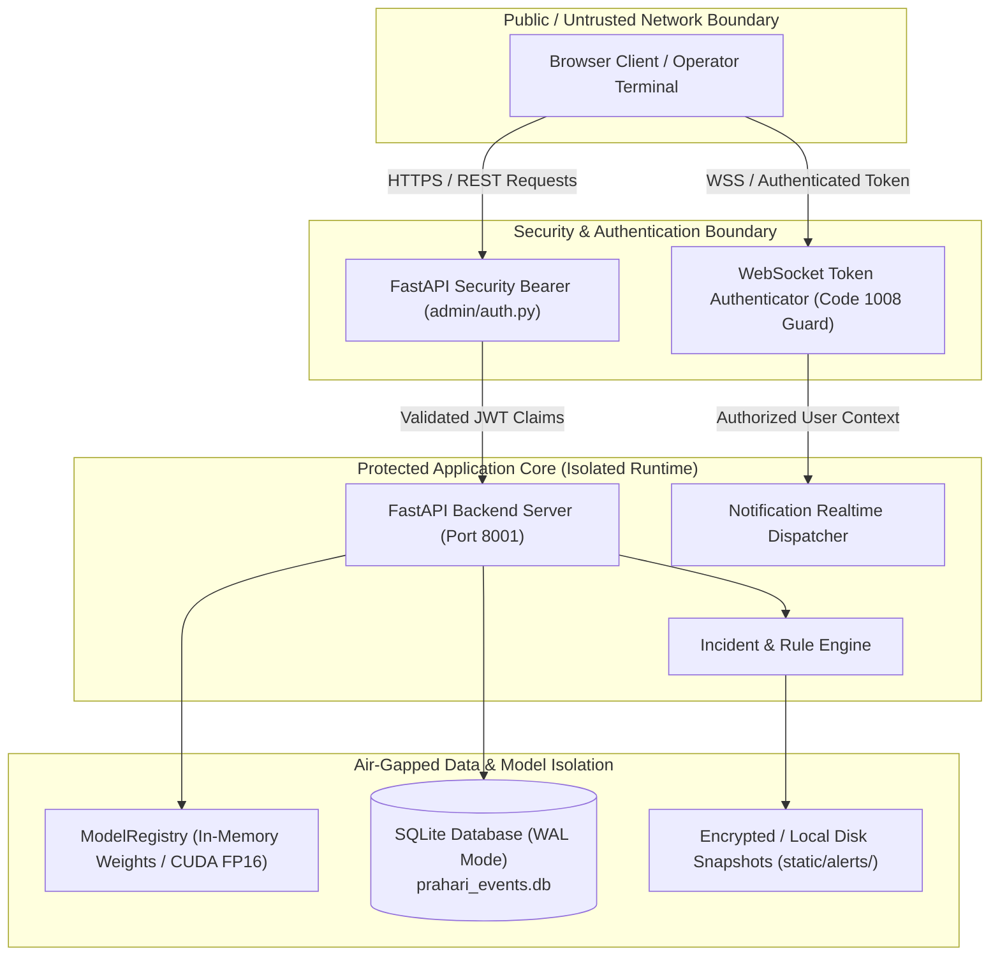

---


## 27. Admin Panel

The Admin Panel (`/admin`) provides a command suite for authorized supervisors and administrators:

- `/admin/overview`: High-level system operational metrics, camera health, and incident resolution stats.
- `/admin/incidents`: Incident management workbench with state-machine filtering, evidence inspection, and status updates.
- `/admin/users`: User management interface (create users, update roles, toggle active status, trigger password resets).
- `/admin/cameras`: Camera configuration manager (update camera names, video sources, and operational parameters).
- `/admin/zones`: Virtual fence and tripwire manager (adjust normalized fence line ratios per camera).
- `/admin/alert-rules`: Security rule engine (enable/disable specific event types, override severities, and adjust cooldowns).
- `/admin/system`: Hardware telemetry, GPU VRAM allocation, CPU usage, and database health indicators.
- `/admin/audit`: Immutable system audit trail tracking all user actions, logins, and status transitions.
- `/admin/notifications`: Historical notification inspector and delivery audit log.

---

## 28. Command Center Dashboard

The Command Center interface at `http://localhost:8001/dashboard` delivers a simple, low-latency operations view inspired by civic SIH presentation patterns: a white and navy surface system, saffron and green status accents, clear actions, and progressive disclosure for detailed evidence.

```text
┌────────────────────────────────────────────────────────────────────────────────────────┐
│ PRAHARI-AI COMMAND CENTER            [Threat: ELEVATED] [🔔 3] [Webcam: Ready] [Admin] │
├───────────────┬───────────────┬────────────────┬────────────────┬──────────────────────┤
│ LIVE CAMERAS  │ AI FPS (AGG)  │ CAPTURE FPS    │ ACTIVE CRIT.   │ GPU MEMORY           │
│ 4 Active      │ 43.4 FPS      │ 118.2 FPS      │ 1 Active       │ RTX 3050 (724 MB)    │
├───────────────┴───────────────┴────────────────┴────────────────┴──────────────────────┤
│ 3+2 SURVEILLANCE GRID                                                                 │
│ ┌──────────────────────────┐ ┌──────────────────────────┐ ┌──────────────────────────┐ │
│ │ CAM-01 Border Post Alpha │ │ CAM-02 Night Surveillance│ │ CAM-03 Perimeter Activity│ │
│ │ [LIVE] [DAY] [28.5 FPS]  │ │ [LIVE] [NIGHT] [29.1 FPS]│ │ [LIVE] [DAY] [27.8 FPS]  │ │
│ │ Objects: 15 (9P, 6V)     │ │ Objects: 3 (1P, 2V)      │ │ Objects: 4 (4P, 0V)      │ │
│ │ [Focus]                  │ │ [Focus]                  │ │ [Focus]                  │ │
│ └──────────────────────────┘ └──────────────────────────┘ └──────────────────────────┘ │
│ ┌──────────────────────────┐ ┌──────────────────────────┐                              │
│ │ CAM-04 Urban Facility    │ │ CAM-WEBCAM (When Active) │                              │
│ │ [LIVE] [DAY] [28.0 FPS]  │ │ [LIVE] [HARDWARE] [30 FPS│                              │
│ │ Objects: 8 (3P, 5V)      │ │ Objects: 1 (1P, 0V)      │                              │
│ │ [Focus]                  │ │ [Focus]                  │                              │
│ └──────────────────────────┘ └──────────────────────────┘                              │
├────────────────────────────────────────────────────────────────────────────────────────┤
│ RECENT SECURITY INCIDENTS                                                              │
│ • 14:22:10 [CAM-01] INTRUSION: Vehicle ID #4 crossed fence [IN]        [View Evidence] │
│ • 14:21:45 [CAM-01] ANPR: Validated Read MH02FU9304 (74%)              [Inspect Plate] │
│ • 14:20:02 [CAM-03] SUSPICIOUS: ID #2 Loitering detected (>20s)         [View Evidence] │
└────────────────────────────────────────────────────────────────────────────────────────┘
```

- **Clear Action Header**: Keeps camera connection, notifications, analytics, and administration available without competing with telemetry.
- **Compact KPI Board**: Surfaces live inputs, AI performance, critical incidents, active incidents, validated ANPR reads, and system health in a consistent status grid.
- **Responsive Camera Wall**: Displays the available camera feeds in a 3+2 desktop arrangement and stacks them for tablet and mobile screens.
- **Live Incident Rail**: Keeps All, Critical, High, ANPR, and Suspicious filters beside the camera wall on desktop and below it on smaller screens.
- **Focus Modal**: Allows operators to expand any camera to high-definition full-screen with real-time HUD telemetry.
- **Lightbox Evidence Modal**: Inspects 1080p intrusion snapshots with annotated fence lines and bounding boxes.

---

## 29. Webcam Integration

PRAHARI-AI supports dynamic USB and integrated hardware webcams:

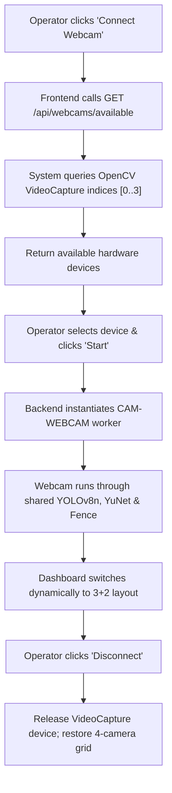

---

## 30. Live Telemetry

All metrics on the dashboard represent true runtime or database measurements:

| Metric Name | Source Layer | Calculation / Meaning | Update Rate |
| :--- | :--- | :--- | :--- |
| **AI FPS (per camera)** | Vision Worker | Actual frames processed by YOLO / Tracking per second. | 1 Second Window |
| **Capture FPS** | Camera Grabber | Raw video frames captured from source stream per second. | 1 Second Window |
| **GPU Memory (VRAM)** | PyTorch CUDA | `torch.cuda.memory_allocated()` in megabytes. | Real-time |
| **Current Objects** | Vision Worker | Count of detected persons and vehicles in current processed frame. | Per Frame |
| **Active Critical** | SQLite Database | Count of unresolved incidents with severity `CRITICAL`. | Live WS / Polling |
| **Threat Status** | Heuristic Engine | Evaluated from active critical incidents and recent intrusions (`NORMAL`, `ELEVATED`, `HIGH`). | Event Driven |
| **Night Mode State** | Vision Worker | Grayscale luminance hysteresis status (`DAY` vs `NIGHT`). | 15-Frame Rolling |

---

## 31. Database Architecture

All surveillance events and operational data are persisted in `prahari_events.db` using SQLite Write-Ahead Logging (`PRAGMA journal_mode=WAL; PRAGMA synchronous=NORMAL;`):

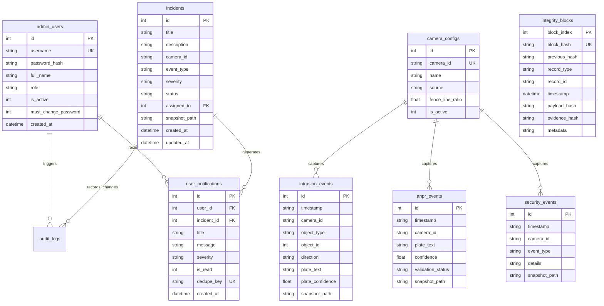

---

## 32. API Reference

### System & Telemetry Endpoints

| Method | Endpoint | Auth Required | Purpose |
| :--- | :--- | :---: | :--- |
| `GET` | `/api/status` | No | System health, aggregate AI FPS, capture FPS, and GPU telemetry. |
| `GET` | `/api/status/{camera_id}` | No | Detailed real-time telemetry for a specific camera channel. |
| `GET` | `/api/dashboard_stats` | No | Consolidated statistics for dashboard header cards. |
| `GET` | `/api/cameras` | No | List of registered cameras and their operational states. |

### Video Streaming Endpoints

| Method | Endpoint | Auth Required | Purpose |
| :--- | :--- | :---: | :--- |
| `GET` | `/video_feed` | No | Primary MJPEG stream (defaults to CAM-01). |
| `GET` | `/video_feed/{camera_id}` | No | Dedicated MJPEG video stream for a specific camera channel. |

### Security Events & ANPR Endpoints

| Method | Endpoint | Auth Required | Purpose |
| :--- | :--- | :---: | :--- |
| `GET` | `/api/alerts` | No | Recent virtual fence intrusion alerts with snapshot links. |
| `GET` | `/api/anpr_log` | No | Historical ANPR plate reads with validation categories. |
| `GET` | `/api/security_events` | No | Behavioral security events (loitering, night motion). |
| `GET` | `/api/analytics` | No | Real-time SQL aggregation summary (hourly incident distribution). |

### Webcam Control Endpoints

| Method | Endpoint | Auth Required | Purpose |
| :--- | :--- | :---: | :--- |
| `GET` | `/api/webcams/available` | No | Probes host OS for attached USB/integrated webcam devices. |
| `POST`| `/api/webcam/start` | No | Starts live capture on selected hardware index as `CAM-WEBCAM`. |
| `POST`| `/api/webcam/stop` | No | Stops and safely releases the webcam hardware device. |

### Notification Endpoints

| Method | Endpoint | Auth Required | Purpose |
| :--- | :--- | :---: | :--- |
| `GET` | `/api/notifications` | Bearer | Paginated notification history with `since_id` delta cursor. |
| `GET` | `/api/notifications/unread-count`| Bearer | Real-time unread notification count for authenticated user. |
| `POST`| `/api/notifications/{id}/read` | Bearer | Marks a specific notification as read. |
| `POST`| `/api/notifications/mark-all-read`| Bearer | Marks all notifications for current user as read. |
| `WS`  | `/api/notifications/ws` | Token Query | Real-time bi-directional WebSocket notification stream. |

### Admin & RBAC Endpoints

| Method | Endpoint | Min Role | Purpose |
| :--- | :--- | :---: | :--- |
| `POST`| `/admin/api/login` | Public | Authenticate with username and password; returns JWT bearer. |
| `GET` | `/admin/api/auth/me` | OFFICER | Returns authenticated user profile and permissions. |
| `GET` | `/admin/api/users` | SUPER_ADMIN | Lists registered system users. |
| `POST`| `/admin/api/users` | SUPER_ADMIN | Creates a new administrative user with assigned RBAC role. |
| `POST`| `/admin/api/users/{id}/reset-password` | SUPER_ADMIN | Resets password for an existing user account. |
| `GET` | `/admin/api/incidents` | OFFICER | Lists security incidents with status and severity filters. |
| `PATCH`| `/admin/api/incidents/{id}/status` | SUPERVISOR | Transitions incident status (`ACKNOWLEDGED`, `RESOLVED`, etc.). |
| `GET` | `/admin/api/audit-logs` | ADMIN | Queries immutable system audit logs. |

### Integrity Ledger Endpoints

The local ledger stores hashes and metadata only. Raw video, snapshots, face data,
and plaintext ANPR payloads remain in the existing local storage layers.

| Method | Endpoint | Min Role | Purpose |
| :--- | :--- | :---: | :--- |
| `GET` | `/api/admin/blockchain/status` | ADMIN | Returns the current chain health and latest block hash. |
| `GET` | `/api/admin/blockchain/verify` | ADMIN | Recomputes every block link and reports the first invalid block. |
| `GET` | `/api/admin/blockchain/blocks` | ADMIN | Lists hash metadata for evidence and audit verification. |

---

## 33. Frontend Architecture

The frontend is built with **React 18** and **Vite**, structured into dedicated feature components:

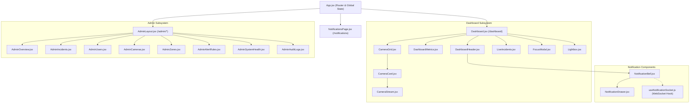

---

## 34. Technology Stack

| Technology | Layer | Version / Release | Primary Responsibility |
| :--- | :--- | :--- | :--- |
| **Python** | Backend Runtime | 3.11.x | Core pipeline orchestration, computer vision, and API services. |
| **FastAPI** | Web Framework | 0.100+ | Asynchronous REST endpoints, MJPEG streaming, and WebSockets. |
| **Uvicorn** | ASGI Server | 0.23+ | High-throughput asynchronous server running the FastAPI application. |
| **SQLite (WAL)** | Persistence | 3.40+ | Local relational database operating in Write-Ahead Logging mode. |
| **SHA-256 Hash Chain** | Evidence Integrity | Python standard library | Hash-linked local ledger for event, evidence, incident, and audit verification. |
| **PyTorch** | Deep Learning | 2.5.1+cu121 | GPU tensor computation and neural network execution. |
| **CUDA** | Hardware Engine | 12.1 / 11.8 | NVIDIA GPU hardware acceleration for deep learning pipelines. |
| **Ultralytics YOLO** | Object Detection | v8.0+ | YOLOv8n inference for real-time person and vehicle localization. |
| **OpenCV** | Computer Vision | 4.10+ | Video ingestion, frame resizing, JPEG encoding, and drawing overlays. |
| **YuNet ONNX** | Face Detection | 2023Mar | Lightweight face bounding box localization via OpenCV DNN. |
| **EasyOCR** | Text Extraction | 1.7+ | Optical Character Recognition for license plate alphanumeric extraction. |
| **React** | Frontend UI | 18.x | Component-based reactive user interface for the Command Center. |
| **Vite** | Build Tooling | 6.x | Modern frontend development server and production bundler. |
| **Lucide React** | UI Icons | 0.400+ | Modern tactical icon set for command center indicators. |
| **CSS Design System** | Frontend Styling | Local CSS | SIH-inspired civic palette, responsive layout, status colors, and accessible action states. |
| **Pytest** | Test Runner | 9.x | Comprehensive unit, acceptance, forensic, and regression testing. |
| **Bcrypt & PyJWT** | Authentication | Latest | Secure password hashing and signed JSON Web Token validation. |

---

## 35. Why Each Technology Is Used

### Python
- **Why**: Standard ecosystem for computer vision, machine learning, and hardware integration.
- **Where**: Complete backend, inference pipelines, and test suites.
- **How**: Coordinates camera workers, GPU inference locks, database transactions, and APIs.
- **Trade-off**: Global Interpreter Lock (GIL) is bypassed by running OpenCV frame capture in C++ native threads and GPU inference on CUDA.

### FastAPI
- **Why**: Native support for asynchronous WebSockets, typing with Pydantic, and low-latency MJPEG streaming.
- **Where**: `main.py`, `admin/admin_routes.py`, `notifications/notification_routes.py`.
- **How**: Serves REST endpoints, streams multipart JPEG feeds, and manages WebSocket connections.
- **Trade-off**: Requires structured async/sync thread management when interfacing with blocking OpenCV calls.

### SQLite in WAL Mode
- **Why**: Serverless, zero-configuration local persistence suitable for air-gapped deployments.
- **Where**: `database.py` (`prahari_events.db`).
- **How**: Write-Ahead Logging (`WAL`) allows concurrent readers while a background thread writes events.
- **Trade-off**: Not suited for horizontal multi-server clustering; ideal for single-box edge installations.

### SHA-256 Hash-Linked Integrity Ledger
- **Why**: Detects changes to the recorded integrity chain without putting sensitive surveillance payloads on a public network.
- **Where**: `blockchain_ledger.py` and `database.py` (`integrity_blocks`).
- **How**: Canonical event metadata, evidence-file hashes, and the previous block hash produce each new block hash. Protected writes append their block in the same SQLite transaction.
- **Trade-off**: This is a local tamper-evident ledger, not yet a distributed blockchain. A future permissioned network can anchor these hashes externally for independent trust.

### Ultralytics YOLOv8n
- **Why**: Exceptional speed-to-accuracy ratio on edge hardware ($<10$ ms latency on RTX 3050).
- **Where**: `rtsp_stream.py` (`weights/yolov8n.pt`).
- **How**: Performs single-pass FP16 inference for person and vehicle detection.
- **Trade-off**: Nano model trades off detection recall on distant/small objects for real-time multi-stream throughput.

### YuNet ONNX
- **Why**: Ultra-fast ($<2$ ms), detection-only face localization model designed for edge surveillance.
- **Where**: `rtsp_stream.py` (`weights/face_detection_yunet_2023mar.onnx`).
- **How**: Executed via OpenCV DNN on cropped person detections every 8 frames.
- **Trade-off**: Detects bounding boxes only; preserves privacy by deliberately omitting facial recognition embeddings.

### EasyOCR
- **Why**: Deep-learning-based OCR resilient to font variations and low-contrast license plates.
- **Where**: `anpr_engine.py`.
- **How**: Extracts alphanumeric text from preprocessed license plate crops.
- **Trade-off**: Higher computational latency than Tesseract, mitigated by queuing plate reads asynchronously.

### React + Vite
- **Why**: Rapid component state updates for live feeds, notification badges, and modals.
- **Where**: `frontend/`.
- **How**: Renders tactical dashboard, manages WebSocket connections, and compiles production bundles.
- **Trade-off**: Requires Node.js tooling during development; production bundle compiles to pure static HTML/JS.

---

## 36. Project Directory Structure

```text
PRAHARI-AI/
├── main.py                     # FastAPI server, route registry & MJPEG streaming
├── camera_manager.py           # Multi-camera registry & dynamic webcam manager
├── rtsp_stream.py              # Camera worker threads, ModelRegistry & analytics
├── centroid_tracker.py         # Multi-object centroid & IoU tracking engine
├── anpr_engine.py              # License plate detection & EasyOCR extraction
├── anpr_consensus.py           # Temporal multi-frame ANPR consensus engine
├── database.py                 # SQLite WAL database manager & relational schema
├── blockchain_ledger.py        # Canonical SHA-256 hashing and integrity-block primitives
├── requirements.txt            # Python dependencies
├── .env.example                # Safe environment configuration template
├── .gitignore                  # Strict repository hygiene & exclusion rules
├── README.md                   # Complete system documentation
├── start_prahari.bat           # Windows Command Prompt launcher
├── start_prahari.ps1           # Windows PowerShell launcher
│
├── admin/                      # Admin & RBAC backend subsystem
│   ├── __init__.py
│   ├── auth.py                 # Bcrypt password hashing & JWT token handling
│   └── admin_routes.py         # Admin REST endpoints (users, cameras, zones, rules)
│
├── notifications/              # Real-time notification backend subsystem
│   ├── __init__.py
│   ├── notification_models.py  # Pydantic models for notification payloads
│   ├── notification_service.py # Recipient resolution & database persistence
│   ├── notification_realtime.py# Thread-safe WebSocket connection manager
│   └── notification_routes.py  # REST history, since_id delta, & WS endpoints
│
├── frontend/                   # React + Vite SIH-inspired Tactical Command Center
│   ├── package.json            # Node.js dependencies & scripts
│   ├── vite.config.js          # Vite build & proxy configuration
│   ├── index.html              # HTML shell entry point
│   └── src/
│       ├── main.jsx            # Application root mount
│       ├── App.jsx             # Top-level routing & layout orchestrator
│       ├── components/
│       │   ├── dashboard/      # Tactical dashboard subsystem
│       │   │   ├── Dashboard.jsx
│       │   │   ├── DashboardHeader.jsx
│       │   │   ├── DashboardMetrics.jsx
│       │   │   ├── CameraGrid.jsx
│       │   │   ├── CameraCard.jsx
│       │   │   ├── CameraStream.jsx
│       │   │   ├── LiveIncidents.jsx
│       │   │   └── MetricCard.jsx
│       │   ├── notifications/  # Notification center components
│       │   │   ├── NotificationBell.jsx
│       │   │   ├── NotificationDrawer.jsx
│       │   │   └── NotificationsPage.jsx
│       │   ├── admin/          # Admin management suite
│       │   │   ├── AdminLayout.jsx
│       │   │   ├── AdminOverview.jsx
│       │   │   ├── AdminIncidents.jsx
│       │   │   ├── AdminUsers.jsx
│       │   │   ├── AdminCameras.jsx
│       │   │   ├── AdminZones.jsx
│       │   │   ├── AdminAlertRules.jsx
│       │   │   ├── AdminSystemHealth.jsx
│       │   │   └── AdminAuditLogs.jsx
│       │   └── common/         # Shared components (ErrorBoundary, Modals)
│       ├── hooks/              # Custom hooks (useNotificationSocket, usePolling)
│       ├── services/           # API clients (adminApi, notificationApi, soundAlert)
│       └── styles/             # Stylesheets (globals.css, dashboard.css)
│
├── weights/                    # Production AI model weights
│   ├── yolov8n.pt              # General object detector (Persons & Vehicles)
│   ├── license-plate-finetune-v1n.pt # Fine-tuned YOLOv11n plate detector
│   └── face_detection_yunet_2023mar.onnx # YuNet face detection ONNX model
│
├── demo_videos/                # Pre-configured core surveillance feeds
│   ├── border_demo.mp4         # CAM-01: Border Post Alpha
│   ├── night_demo.mp4          # CAM-02: Night Surveillance Bravo
│   ├── activity-demo.mp4       # CAM-03: Perimeter Activity Charlie
│   └── cctv_demo.mp4           # CAM-04: Urban Facility Delta
│
├── static/                     # Snapshot evidence directories (structure preserved)
│   ├── alerts/.gitkeep         # Intrusion evidence snapshots
│   ├── anpr/.gitkeep           # License plate crops
│   └── anpr_debug/.gitkeep     # ANPR candidate debug crops
│
├── tests/                      # Automated test suites
│   ├── test_final_acceptance_suite.py # Complete 72-point system acceptance suite
│   ├── test_p0_regressions.py         # 13-point critical P0 regression suite
│   ├── test_full_suite.py             # 9-point multi-camera & database suite
│   ├── test_anpr_accuracy_fix.py      # ANPR syntax & temporal consensus suite
│   ├── test_dashboard_metric_audit.py # Telemetry truth & provenance suite
│   ├── test_notification_comprehensive_suite.py # Notification backend suite
│   ├── test_notification_forensic_suite.py      # E2E notification suite
│   ├── test_notification_ui_fixes.py           # UI state & drawer suite
│   ├── test_notification_ux_redesign.py         # Alert routing suite
│   └── admin/                         # Admin & RBAC verification suites
│       ├── test_admin_auth.py
│       ├── test_admin_hardening.py
│       ├── test_admin_modules.py
│       ├── test_admin_rbac.py
│       ├── test_data_truth_pipeline.py
│       └── test_notification_system.py
│
└── reports/                    # Verified forensic audit reports
```

---

## 37. Installation

### Prerequisites
- **Operating System**: Windows 10/11, Ubuntu 20.04/22.04 LTS, or macOS.
- **Python**: Version `3.10`, `3.11`, or `3.12` (Python 3.11 recommended).
- **Node.js**: Version `18.x` or `20.x` LTS with `npm`.
- **GPU Hardware**: NVIDIA GPU with CUDA 11.8 or 12.1 recommended (CPU fallback supported).

### Step 1: Clone the Repository
```bash
git clone https://github.com/abhishek-khairnar/PRAHARI-AI.git
cd PRAHARI-AI
```

### Step 2: Set Up Python Virtual Environment

**Windows (PowerShell)**:
```powershell
python -m venv venv
.\venv\Scripts\Activate.ps1
```

**Windows (Command Prompt)**:
```cmd
python -m venv venv
venv\Scripts\activate.bat
```

**Linux / macOS**:
```bash
python3 -m venv venv
source venv/bin/activate
```

### Step 3: Install Python Dependencies
```bash
pip install -r requirements.txt
```

### Step 4: Install Frontend Dependencies & Build
```bash
cd frontend
npm install
npm run build
cd ..
```

---

## 38. Configuration

PRAHARI-AI is pre-configured to run locally out of the box. To customize settings, copy `.env.example` to `.env`:

```bash
cp .env.example .env
```

Key configuration variables:
- `PRAHARI_ENV`: Set to `development` for local testing or `production` for security-enforced deployments.
- `PRAHARI_SECRET_KEY`: Minimum 32-character secret key used to sign JWT tokens.
- `PRAHARI_ADMIN_PASSWORD`: Initial bootstrap password for the `superadmin` account.
- `PORT`: HTTP port for the FastAPI server (default: `8001`).

---

## 39. GPU / CUDA Setup

PRAHARI-AI automatically detects CUDA acceleration. Verify GPU availability:

```bash
python -c "import torch; print(f'CUDA Available: {torch.cuda.is_available()} | Device: {torch.cuda.get_device_name(0) if torch.cuda.is_available() else \"CPU Fallback\"}')"
```

If PyTorch defaults to CPU on an NVIDIA machine, reinstall with the appropriate CUDA wheel:

```bash
# For CUDA 12.1 (Recommended)
pip install torch torchvision --index-url https://download.pytorch.org/whl/cu121

# For CUDA 11.8
pip install torch torchvision --index-url https://download.pytorch.org/whl/cu118
```

---

## 40. Running PRAHARI-AI

### Deployment & Runtime Architecture

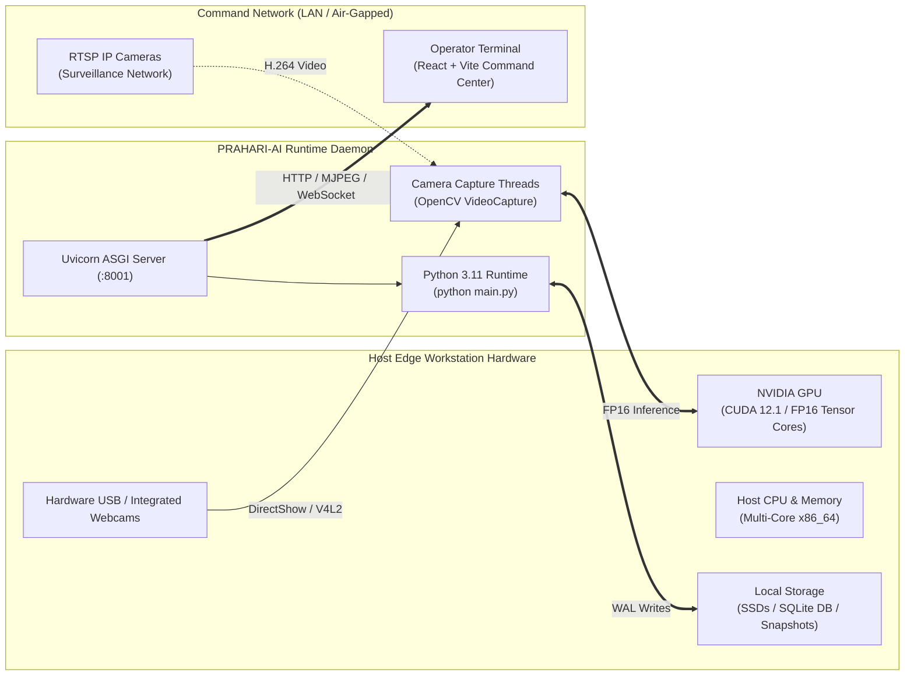

### Production Mode (Single Endpoint)


Ensure the frontend is built (`cd frontend && npm run build && cd ..`), then launch the backend:

```bash
python main.py
```

Open your browser at:
```
http://localhost:8001
```
FastAPI automatically serves the compiled React command center from `frontend/dist`.

Alternatively, use the Windows one-click launchers:
- **Command Prompt**: `start_prahari.bat`
- **PowerShell**: `.\start_prahari.ps1`

### Development Mode (Hot Reloading)

For frontend UI development with instantaneous hot reloading:

**Terminal 1 (Backend API & Video Ingestion)**:
```bash
python main.py
```

**Terminal 2 (Vite Development Server)**:
```bash
cd frontend
npm run dev
```
Open `http://localhost:5173`. Vite proxies all API and stream requests to port 8001.

---

## 41. Webcam Setup

1. Connect a USB webcam or enable your laptop's integrated camera.
2. Launch PRAHARI-AI and navigate to `http://localhost:8001`.
3. Click the **Webcam** button in the header bar.
4. The system queries connected video capture devices. Select device `Index 0` (or your preferred camera index) and click **Connect**.
5. The `CAM-WEBCAM` feed activates immediately in the grid, running deep learning detection, face counting, and virtual fence tracking.
6. Click **Disconnect** when finished to release the hardware camera device.

---

## 42. Automated Testing

PRAHARI-AI includes an extensive automated test suite covering unit logic, integration workflows, database immutability, and security RBAC:

```bash
# Run Critical P0 Regression Suite
python -m pytest tests/test_p0_regressions.py -v

# Run Final Acceptance Suite (72 End-to-End Verifications)
python -m pytest tests/test_final_acceptance_suite.py -v

# Run Admin & RBAC Test Suite
python -m pytest tests/admin/ -v

# Run ANPR Accuracy & Temporal Consensus Suite
python -m pytest tests/test_anpr_accuracy_fix.py -v

# Run Dashboard Telemetry Provenance Audit Suite
python -m pytest tests/test_dashboard_metric_audit.py -v

# Run Core Multi-Camera & Database Suite
python -m pytest tests/test_full_suite.py -v
```

> [!NOTE]
> Tests utilize isolated in-memory or temporary databases to guarantee that the production database (`prahari_events.db`) is never modified or corrupted during test execution.

---

## 43. Current Validation Status

All test suites pass with 100% success across the codebase:

```text
============================= TEST EXECUTION SUMMARY =============================
Suite                                        Pass   Fail   Status
----------------------------------------------------------------------------------
Final Acceptance (tests/test_final_acceptance_suite.py)    72      0     VERIFIED
P0 Regressions (tests/test_p0_regressions.py)              13      0     VERIFIED
Admin & RBAC (tests/admin/)                               48      0     VERIFIED
ANPR Accuracy & Consensus (tests/test_anpr_accuracy_fix.py) 44     0     VERIFIED
Dashboard Telemetry Audit (tests/test_dashboard_metric_audit.py) 22 0     VERIFIED
Core Multi-Camera & Database (tests/test_full_suite.py)    9      0     VERIFIED
Notification Unit Suites                                  17      0     VERIFIED
Frontend Production Build (frontend/npm run build)         1      0     VERIFIED
Integrity Ledger Smoke Checks                              2      0     VERIFIED
----------------------------------------------------------------------------------
TOTAL EXISTING PYTEST ASSERTIONS PASSED                  225      0     READY
==================================================================================
```

Model weight integrity verified before release:
- `weights/yolov8n.pt`: `F59B3D833E2FF32E194B5BB8E08D211DC7C5BDF144B90D2C8412C47CCFC83B36` (**MATCH**)
- `weights/license-plate-finetune-v1n.pt`: `0AEC75976C56EB6F26DFB274C430620EC65137915FF1AE47C3A48C7AF8AFB7B2` (**MATCH**)
- `weights/face_detection_yunet_2023mar.onnx`: `8F2383E4DD3CFBB4553EA8718107FC0423210DC964F9F4280604804ED2552FA4` (**MATCH**)

Frontend verification:
- `Push-Location frontend; npm run build; Pop-Location` (**PASS**)
- Desktop and mobile command-center smoke checks completed against the Vite preview.

Integrity-ledger verification:
- Temporary SQLite database event + incident chain verification (**PASS**)
- Temporary SQLite database administrative audit anchoring verification (**PASS**)

---

## 44. Performance

The following benchmarks represent measured development workstation performance:

| Metric | Measured Specification |
| :--- | :--- |
| **Development Host** | NVIDIA GeForce RTX 3050 Laptop GPU (6GB VRAM) / Intel Core CPU / 16GB RAM |
| **Operating System** | Windows 11 / Python 3.11.9 / PyTorch 2.5.1+cu121 |
| **Total GPU Memory Footprint** | ~724 MB VRAM across all 4 active camera channels |
| **Aggregate AI Processing Rate** | ~43.4 Aggregate AI FPS (~10.8 AI FPS per camera feed) |
| **Video Stream Ingestion Rate** | ~28–30 Capture FPS per channel |
| **YOLOv8n Single-Pass Latency** | ~8–15 ms per frame on CUDA (FP16) |
| **YuNet Face Detection Latency** | <2 ms amortized latency (evaluated every 8th frame) |
| **SQLite WAL Write Latency** | <1 ms per event record |

> [!NOTE]
> Measured benchmarks depend directly on host hardware specifications, video stream resolutions, active AI modules, and concurrent client connections.

---

## 45. Troubleshooting

| Symptom | Probable Cause | Recommended Action |
| :--- | :--- | :--- |
| **CUDA Not Detected (Falling back to CPU)** | CPU-only PyTorch wheel installed in environment. | Reinstall PyTorch with CUDA index URL (`pip install torch torchvision --index-url https://download.pytorch.org/whl/cu121`). |
| **Demo Video Not Found** | Missing demo video or incorrect filename. | Ensure `demo_videos/` contains all 4 video files. Verify CAM-03 is named `activity-demo.mp4` (with a hyphen). |
| **Port 8001 Already Occupied** | Previous server instance still running. | Terminate the process using port 8001, or start with a custom port: `set PORT=8002 && python main.py`. |
| **Webcam Fails to Open** | Device occupied by another app (Zoom, Teams). | Close external camera applications and restart webcam in the dashboard. |
| **WebSocket Closes with Code 1008** | Missing or invalid authentication token. | Log in via `/admin` to obtain a valid JWT token before accessing secured alerts. |
| **Database File Locked** | Non-WAL mode or external SQLite viewer lock. | Ensure database initializes with WAL mode (`PRAGMA journal_mode=WAL;`). Close external database browser tools. |

---

## 46. Repository Hygiene

To maintain security, privacy, and version control cleanliness, the following artifacts are strictly excluded via `.gitignore`:

- **Runtime Databases**: `*.db`, `*.db-wal`, `*.db-shm`, `*.db-journal`, `db_backups/`.
- **Runtime Snapshots**: `static/alerts/*`, `static/anpr/*`, `static/anpr_debug/*` (empty directory structure preserved via `.gitkeep`).
- **Secrets & Credentials**: `.env`, `.env.*` (only `.env.example` is tracked), `*.secret`, `*.pem`, `*.key`.
- **Build Outputs & Dependencies**: `frontend/dist/`, `node_modules/`, `frontend/node_modules/`, `__pycache__/`, `.pytest_cache/`.
- **Experimental Models & Runs**: `runs/`, `weights/candidates/`, `yolo26n.pt`, `dataset/`, `dataset_v2/`.
- **External Binaries**: `mediamtx/`, `ffmpeg/`, `test.mp4` (external infrastructure locked by `AGENTS.md`).

---

## 47. Team Quick Start

For new developers joining the PRAHARI-AI project:

1. **Clone & Environment Setup**:
   ```bash
   git clone https://github.com/abhishek-khairnar/PRAHARI-AI.git
   cd PRAHARI-AI
   python -m venv venv
   .\venv\Scripts\Activate.ps1
   pip install -r requirements.txt
   ```
2. **Build Frontend Assets**:
   ```bash
   cd frontend
   npm install
   npm run build
   cd ..
   ```
3. **Verify AI Models & Demo Videos**:
   Ensure `weights/yolov8n.pt`, `weights/license-plate-finetune-v1n.pt`, and `weights/face_detection_yunet_2023mar.onnx` exist in `weights/`, and all 4 demo videos exist in `demo_videos/`.
4. **Run Verification Test**:
   ```bash
   python -m pytest tests/test_p0_regressions.py tests/test_final_acceptance_suite.py -v
   ```
5. **Start Application**:
   ```bash
   python main.py
   ```
   Open `http://localhost:8001` in your browser.

---

## 48. SIH Demonstration Flow

A structured 10-step demonstration sequence for evaluators, judges, and security officials:

1. **System Startup**: Run `start_prahari.bat`. Highlight console initialization showing CUDA GPU detection, shared `ModelRegistry` weight loading, and 4 camera thread starts.
2. **Command Center Overview**: Open `http://localhost:8001`. Showcase the responsive multi-camera grid and top KPI indicators (Live Cameras, Aggregate AI FPS, Capture FPS, GPU Memory).
3. **Virtual Fence Intrusion**: Observe CAM-01 (*Border Post Alpha*). As vehicles cross the virtual tripwire, point out instant `[IN]` or `[OUT]` breach classifications.
4. **Evidence Lightbox**: Click any breach alert thumbnail to open the Lightbox modal. Show the full-resolution 1080p annotated evidence snapshot with bounding boxes and fence coordinates.
5. **Temporal Consensus ANPR**: Showcase the ANPR feed. Explain the two-stage pipeline (plate localization + EasyOCR) and demonstrate multi-frame temporal consensus voting.
6. **Nocturnal Surveillance**: Observe CAM-02 (*Night Surveillance Bravo*). Explain the purple `[NIGHT]` badge governed by dual-threshold luminance hysteresis ($85.0 / 98.0$) to resist headlight flicker.
7. **Dwell-Time Loitering**: Inspect CAM-03 (*Perimeter Activity Charlie*). Show how stationary targets trigger loitering alerts after remaining within a 100px radius for $\ge 20$ seconds.
8. **Privacy-Preserving Face Counter**: Highlight `Total Live Faces` in the header. Explain that YuNet provides crowd-density telemetry without biometric identification or storage.
9. **Dynamic Hardware Webcam**: Click **Webcam** in the navigation bar, start the connected USB camera as `CAM-WEBCAM`, and demonstrate real-time AI tracking on the live feed.
10. **Admin & Incident Management**: Log in to `/admin` as `superadmin`. Walk through the Incident Lifecycle state machine, camera fence-line adjustments, and immutable audit logs.

---

## 49. Known Limitations

- **Shared Inference Serialization**: In the current architecture, camera worker threads serialize deep learning inference under mutex locks (`yolo_infer_lock`). Scaling beyond 8 concurrent streams on a single GPU will require dynamic tensor batching.
- **Distant License Plates**: Extremely distant, heavily blurred, or acutely angled plates are classified as `NOT_READ` to prevent OCR hallucination.
- **External Vehicle Registry**: PRAHARI-AI performs local syntactic ANPR validation; authoritative vehicle ownership verification requires external integration with databases like VAHAN.
- **Webcam Driver Permissions**: Dynamic webcam ingestion requires host operating system camera access permissions.
- **Local Integrity Ledger Boundary**: The current SHA-256 chain is stored in the local SQLite database. It provides tamper evidence and verification, but independent multi-site trust requires external anchoring to a permissioned blockchain.

---

## 50. Future Roadmap

- [ ] **Dynamic Tensor Batching**: Implement cross-stream tensor batching to scale to 16+ concurrent camera channels per GPU.
- [ ] **Custom Vehicle Classification**: Fine-tune YOLO on regional traffic datasets to classify auto-rickshaws, agricultural tractors, and specialized military vehicles.
- [ ] **Edge Containerization**: Provide Docker images optimized for NVIDIA Jetson Orin Nano and Xavier NX embedded modules.
- [ ] **External Dispatch Channels**: Webhook dispatch for Telegram, SMS, and secure SMTP email notifications upon critical breaches.
- [ ] **PTZ Camera Control**: ONVIF integration for automated pan-tilt-zoom tracking of perimeter intruders.
- [ ] **Permissioned Blockchain Anchoring**: Periodically anchor integrity-ledger batches to Hyperledger Fabric or another permissioned network for independent multi-site verification.
- [ ] **Evidence Verification Reports**: Generate signed incident reports containing evidence hashes and external ledger transaction references.

---

## 51. Privacy & Responsible AI

- **Detection-Only Design**: Face analytics are strictly detection-only. PRAHARI-AI localizes face bounding boxes to estimate crowd density.
- **No Identity Recognition**: The platform does **not** identify individuals, compare faces against watchlists, or perform facial recognition.
- **No Biometric Storage**: No facial embeddings, biometric templates, or identity vectors are generated or saved in the database.
- **Local Data Governance**: All surveillance snapshots, event logs, and database records remain 100% on-premises under local operator control.

---

## 52. Contribution Workflow

1. **Pull Latest Main**:
   ```bash
   git checkout main
   git pull origin main
   ```
2. **Create Feature Branch**:
   ```bash
   git checkout -b feature/your-feature-name
   ```
3. **Implement & Test**:
   Make changes and ensure all test suites pass:
   ```bash
   python -m pytest tests/test_p0_regressions.py tests/test_final_acceptance_suite.py
   ```
4. **Inspect Diff**:
   ```bash
   git status
   git diff
   ```
5. **Commit & Push**:
   ```bash
   git commit -m "feat: concise description of change"
   git push origin feature/your-feature-name
   ```
6. **Open Pull Request**: Submit PR for review. Never commit `.env`, `*.db`, or experimental models.

---

## 53. Credits

- **Object Detection**: [Ultralytics YOLOv8](https://github.com/ultralytics/ultralytics) by Ultralytics
- **Facial Analytics**: [YuNet ONNX](https://github.com/opencv/opencv_zoo/tree/master/models/face_detection_yunet) by OpenCV Zoo
- **OCR Engine**: [EasyOCR](https://github.com/JaidedAI/EasyOCR) by JaidedAI
- **Web Framework**: [FastAPI](https://fastapi.tiangolo.com/) by Sebastián Ramírez
- **Frontend Engine**: [React](https://react.dev/) & [Vite](https://vitejs.dev/)
- **Iconography**: [Lucide Icons](https://lucide.dev/)

---

## 54. License

This project is licensed under the **MIT License**. See the repository for full license details. Open source for academic, evaluation, and security research purposes.
