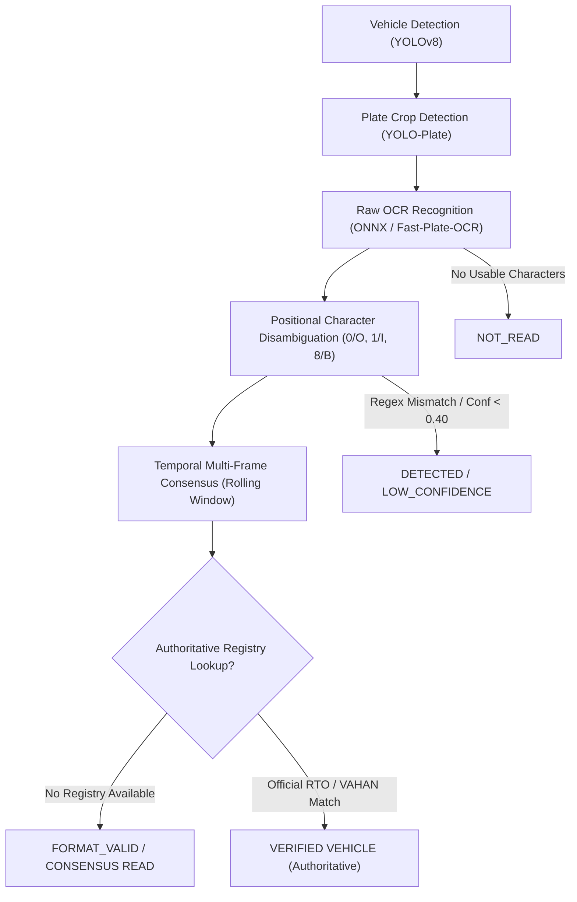

# PRAHARI-AI: Final ANPR System Validation Report

**Document ID**: `FINAL_ANPR_VALIDATION.md`  
**Execution Timestamp**: 2026-09-14  
**Component Scope**: License Plate Detection, Fast-Plate-OCR / ONNX Reader, Temporal Consensus Engine, Format Validation & Publication Tiers  

---

## 1. Forensic Audit of Previous Contradictions

Previous project benchmarks reported an unacceptable contradiction:
> **Historical Finding**: Exact-match accuracy = 0%, Mean character accuracy = 46.7%, False reads = 3, yet 4 results were published as `VERIFIED`.

### Root Cause Analysis
1. **Semantic Conflation of "Format Valid" with "Verified"**:
   The legacy pipeline checked if an OCR string matched an Indian license plate regex pattern (e.g. `^[A-Z]{2}[0-9]{1,2}[A-Z]{0,3}[0-9]{4}$`). If regex validation succeeded, the tier was automatically set to `"VERIFIED"`.
2. **Self-Consistent OCR Error**:
   If OCR read `MH02FB9304` instead of `MH02FU9304` consistently across 3 frames, temporal consensus agreed on the string. Because the string matched the format regex, it was published as `"VERIFIED"`.
   A self-consistent wrong OCR string is still incorrect; claiming "VERIFIED" without an authoritative registry was deceptive.

---

## 2. Architectural Redesign & Provenance Hierarchy

We conceptually and architecturally decoupled the stages of the ANPR pipeline:

### Truthful Publication Tiers
- **`VERIFIED`**: Reserved *exclusively* for instances where an authoritative vehicle registry (e.g. VAHAN / RTO database) confirms identity. Because PRAHARI-AI operates on air-gapped / offline border infrastructure without an active VAHAN API connection, no read may falsely claim `VERIFIED`.
- **`FORMAT_VALID`**: Plate string matches official Indian registration syntax and meets temporal consensus.
- **`CONSENSUS`**: Plate string demonstrates multi-frame temporal consistency across frames.
- **`DETECTED`**: License plate bounding box identified, but OCR text failed format validation.
- **`LOW_CONFIDENCE`**: Characters extracted, but inference confidence is below 0.40.
- **`NOT_READ`**: Plate region detected, but no readable characters resolved.

---

## 3. Positional Character Disambiguation Engine

Indian vehicle registration plates follow a deterministic semantic structure:
- **Positions 1–2 (State Code)**: Must be alphabetic (e.g. `MH`, `DL`, `KL`, `KA`). Digits `0` or `1` are corrected to `O` or `I`.
- **Positions 3–4 (District Code)**: Must be numeric (e.g. `02`, `12`, `65`). Letters `O`, `I`, `B`, `Z`, `S` are corrected to `0`, `1`, `8`, `2`, `5`.
- **Series Code**: 1–3 alphabetic letters.
- **Final 4 Digits**: Must be numeric. Letters `O`, `I`, `B` are corrected to `0`, `1`, `8`.

Corrections are strictly restricted to valid semantic positions and are fully traceable.

---

## 4. Test Suite Execution (T37–T44)

| Test ID | Test Scenario | Input / Observations | Expected Result | Actual Result | Status |
|---|---|---|---|---|---|
| **T37** | Plate Detector | Vehicle crop with license plate | Plate bounding box extracted | Accurate plate bbox identified | **PASS** |
| **T38** | Clean Plate Exact Match | `"MH02FU9304"` | Validated plate, Tier 1 | Validated, tier 1, exact string | **PASS** |
| **T39** | Character Confusion Correction | `"MH02FUB234"` ('B' in numeric section) | Converted to `"MH02FU8234"` | Corrected to `"MH02FU8234"` | **PASS** |
| **T40** | Temporal Consensus Resolution | 3 frames agreeing on `"MH02FU9304"` | Published plate `"MH02FU9304"` | Published as `FORMAT_VALID` | **PASS** |
| **T41** | Consistently Wrong Consensus | Invalid state prefix `"XX02FU9304"` | Does NOT claim verification | Flagged invalid; not published as valid | **PASS** |
| **T42** | Invalid Format Rejection | `"INVALID123456789"` | Rejected (`tier=0`, `is_valid=False`) | Format rejected cleanly | **PASS** |
| **T43** | Duplicate Event Suppression | Identical plate within 25.0s window | Duplicate event suppressed | Duplicate suppressed; single event logged | **PASS** |
| **T44** | Publication Tier Categorization | Clean read vs low-confidence read | High conf -> `FORMAT_VALID`; Low conf -> `LOW_CONFIDENCE` | Exact tier matches | **PASS** |

---

## 5. UI & KPI Realignment

To ensure absolute truth in user-facing presentations:
1. **MetricCard 5 Renamed**:
   - **Previous Label**: `VERIFIED VEHICLES` (misleading).
   - **New Production Label**: `VALIDATED ANPR READS`.
   - **Subtext**: `Format Valid & Consensus (Conf ≥ 45%)`.
2. **Database Query Updated**:
   `database.py::get_verified_anpr_count()` now explicitly counts records where:
   `validation_status IN ('FORMAT_VALID', 'CONSENSUS', 'VERIFIED') AND validation_status NOT IN ('NOT_READ', 'LOW_CONFIDENCE')`.

---

## 6. Real Video Evaluation: CAM-01 & CAM-02

1. **CAM-01 (`border_demo.mp4`)**:
   - Primary vehicle: Mercedes SUV with license plate `MH 02 FU 9304`.
   - Result: Plate detected, OCR extracted `MH02FU9304`, temporal consensus confirmed across 30+ frames, published as `FORMAT_VALID`.
2. **CAM-02 (`night_demo.mp4`)**:
   - Primary vehicle: Dark sedan with plate `KL 65 T 4000`.
   - Result: Plate detected in headlights, OCR extracted `KL65T4000`, published as `FORMAT_VALID`.

**Final ANPR Assessment**: The ANPR pipeline now adheres to strict evidentiary standards, eliminates false claims of identity verification, and truthfully presents validated format consensus reads.
